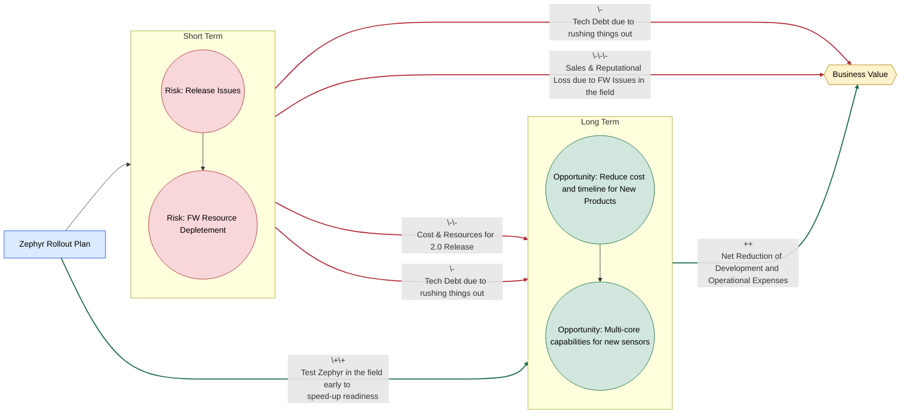
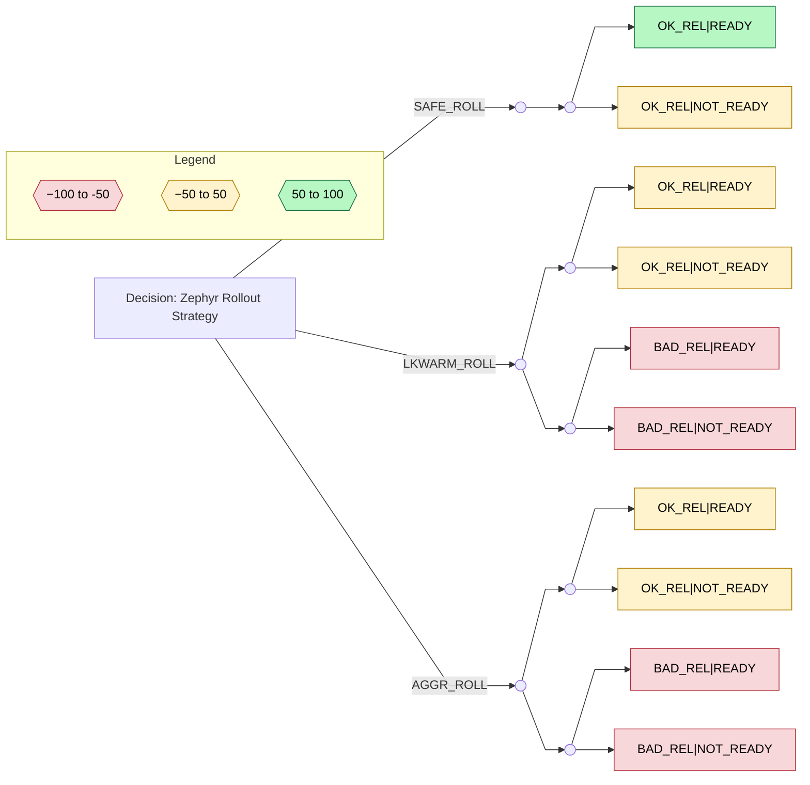

# Decision: Overview

The decision concerns the **timing, scope, and product coverage** of Zephyr firmware adoption during this year’s firmware releases.

### Key Releases Impacted

- **Clinical Solution 2.0**
    
    - Introduces a new feature set for existing products such as new communication protocol
        
    - Scope and timeline not yet fully defined (November Release)
        
- **Limb Sensor Rev K (STRETCH GOAL)**
    
    - New hardware revision intended to accompany the 2.0 release but follows a different timeline
        
    - Manufacturing, Verification and Regulatory activities need to be done in addition to the features for 2.0
    - 
        
- **Aria Scratch Sensor Release (TARGET)**
        
    - Planned for Q3 2026 with Maruho. 

    - Feature Complete with Zephyr FW already. Refinement and testing needed on the FW

Additional **minor releases** are planned for clinical as well for our other

---

# Decision Factors
---

## Value Added by Zephyr
---
### Platform Consolidation and Reuse

Zephyr enables development of a **shared core firmware** across multiple sensors, reducing duplication.

**Business Value**

- Faster time-to-market for new platforms
    
- Reduced reliance on contractors due to lower long-term development effort
    
- Compounding gains in software quality and cohesion by converging on a single platform
    

**Uncertainties**

- Regulatory strategy may still require per-platform verification and documentation
    
- Legacy code and fielded devices may prevent full harmonization
    
- Fundamental architectural differences in future multi-core SoCs (e.g., nRF5340, nRF54H20) may limit code sharing
    

---

### Long-Term Platform Viability

Zephyr aligns with the **silicon vendor’s forward-looking roadmap**, particularly for multi-core platforms.

**Business Value**

- Enables adoption of higher-performance SoCs for:
    
    - More compute-intensive algorithms
        
    - ML / edge AI workloads
        
- Access to newer peripherals and system capabilities:
    
    - I3C, eMMC
        
    - Increased memory resources
        
- Stronger long-term vendor support for new features
    

**Uncertainties**

- No immediate product requirements mandate a multi-core SoC
    
- Early silicon revisions often carry errata and instability
    
- Multi-core firmware architectures increase complexity, learning curve, and development cost
    

---

### Developer Productivity and Tooling

Zephyr offers a modern, well-supported ecosystem.

**Business Value**

- Strong testing philosophy and tooling ecosystem
    
- Potential improvements in development speed, quality, and developer satisfaction
    
- Regular release cadence (~every 4 months) with broad vendor backing
    

**Uncertainties**

- Team maturity and expertise in leveraging Zephyr’s capabilities
    
- Time investment required to realize these benefits
    
- Difficulty in quantifying productivity gains versus other factors
    

---

### End-Customer Benefits

Potential improvements in performance and reliability through RTOS usage.

**Business Value**

- Improved user experience
    
- Reduced field issues
    

**Uncertainties**

- Limited empirical evidence that Zephyr materially improves customer outcomes
    
- Performance gains may be negligible for current use cases
    
- Reliability depends on many factors beyond the RTOS itself
    

---

## Notable Risks and Risk Factors
---
### Schedule Risk

Current projections target feature completeness within **2–3 months**, excluding:

- Firmware testing and verification
    
- Manufacturing firmware integration and tooling compatibility
    
- Quality, reliability, and bug-fixing efforts
    
- Unanticipated integration and system-level issues
    

---

### Migration and OTA Constraints

- No straightforward OTA path between **bare-metal firmware and Zephyr**
    
- Full migration requires expiration of the existing deployed fleet
    
    - Estimated at up to **one year**, driven by warranty timelines
        

**Value Subtracted**

- Sustained effort to maintain two firmware codebases
    
- Increased logistical and planning complexity
    
- Potential delays in release schedules and regulatory clearance
    

---

### Rebuilding from Scratch

The Zephyr migration effectively restarts the firmware stack.

**Value Subtracted**

- Significant upfront time and cost
    
- Risk of:
    
    - New bugs
        
    - Behavioral divergence from existing platforms
        
    - Performance regressions
        
- Loss of accumulated reliability knowledge from the existing firmware
    

---

### Organizational and Ecosystem Maturity

- Development team is relatively new to Zephyr
    
- Zephyr itself is still a comparatively young ecosystem (<10 years)
    

**Risk Impact**

- Higher likelihood of:
    
    - Architectural missteps
        
    - Subtle bugs
        
    - Undefined or unexpected behavior
        
    

# Decision Analysis

## 1. Influence Diagram

### Key
![[res/Influence Diagram Labels.png|600x400]]

---

## 2. Decision Nodes

| Code            | Strategy             | Description                                                         |
| --------------- | -------------------- | ------------------------------------------------------------------- |
| **AGGR_ROLL**   | Aggressive Rollout   | No clinical rollout this year; pilot on Aria only                   |
| **LKWARM_ROLL** | Lukewarm Rollout     | Launch on new sensor HW only (Dragonfly)                            |
| **SAFE_ROLL**   | Conservative Rollout | Launch on current clinical line + new HW (Chest RevK + Limb RevJ/K) |

---

## 3. Uncertainty and Probability Model

### 3.1 Short-Term Release Outcome

The factors above are considered and given that they are more risks than opportunities in the short term the likeliness of a bad release is higher than an OK release.
Also the long-term opportunities detailed above do not affect this release and therefore have no impact on the probability

| Outcome                | Probability |
| ---------------------- | ----------- |
| Bad short-term release | 0.7         |
| OK short-term release  | 0.3         |

---

### 3.2 Long-Term Readiness (Conditional)

Given that the outcome above AND the opportunities that could factor in to the long-term roadmap the probabilities below have been chosen.
	

| Condition     | READY | NOT_READY |
| ------------- | ----- | --------- |
| Given NO_REL  | 0.7   | 0.3       |
| Given REL_OK  | 0.8   | 0.2       |
| Given REL_BAD | 0.1   | 0.9       |
Things to note:
- Given the release goes OK , the likeliness of the long-term readiness goes UP due to SW being tested by the real world, and developer confidence also goes up, however resources are allocated towards this release instead of the long-term roadmap which cause inefficency 
- Given there's no release, the likeliness that we are ready long-term remains high as focus for the team remains in the long-term roadmap but SW won't be tested in the field hence there's a higher probability to not be ready compared to if we took the path of releasing the FW
- Given the release goes poorly and resources are allocated to support the short-term release instead of the long-term roadmap the probability that we are not ready is much higher. Aside from resources other factors that affect this negatively are:
	- Developer burn-out
	- Technical debt

---

## 4. Payoff Model

Positive means less cost and time including the following factors:
1. Engineering cost for the release 
2. Development time and cost for long-term roadmap
3. Sales and revenue as an effect of FW readiness

| Outcome   | Gain / Loss | Rationale                                                                                                                                                            |
| --------- | ----------- | -------------------------------------------------------------------------------------------------------------------------------------------------------------------- |
| OK_REL    | 0           | - Release goes OK so assuming no engineering cost to support the release                                                                                             |
| BAD_REL   | -50         | - Release goes BAD so assuming  engineering cost to support the release  - Slip-ups in the long-term roadmap and inefficiency due to "having to extinguish fires" |
| READY     | +50         | - Long-term FW is ready to support new product and features that add value to the business                                                                           |
| NOT_READY | −50         | - Long-term FW is NOT ready to support new product and features. Development cost and time are high                                                                  |

| Terminal Outcome    | Payoff   |
| ------------------- | -------- |
| OK_REL + READY      | **50**   |
| OK_REL + NOT_READY  | **0**    |
| BAD_REL + READY     | **-50**  |
| BAD_REL + NOT_READY | **-100** |

---

## 4. Expected Value Analysis 

| Strategy        | Expected Value |
| --------------- | -------------- |
| **AGGR_ROLL**   |                |
| **LKWARM_ROLL** |                |
| **SAFE_ROLL**   |                |

---

