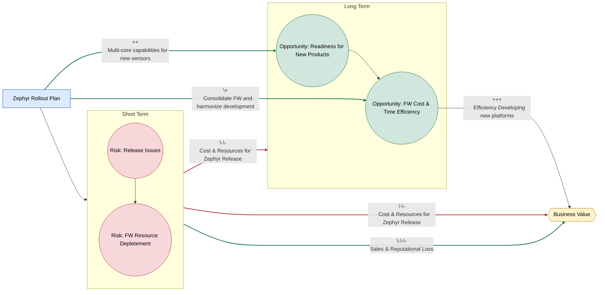
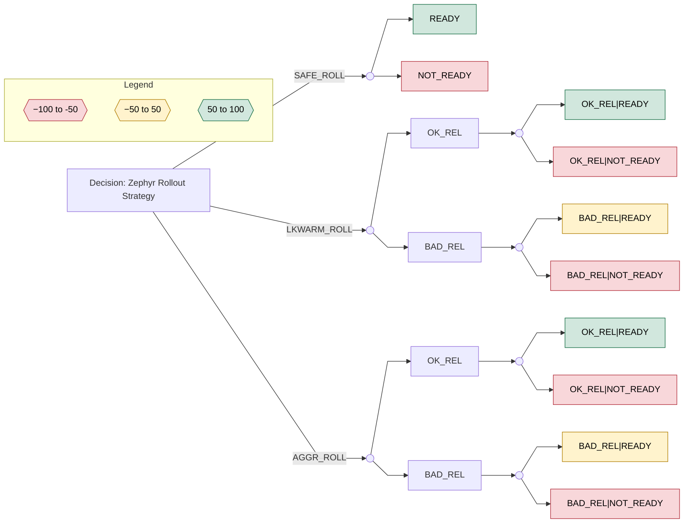

# Decision: Overview

The decision concerns the **timing, scope, and product coverage** of Zephyr firmware adoption during this year’s **Clinical** releases. Left out on purpose are the Aria Maruho release which is not part of clinical product line and follows a different regulatory strategy and is already running Zephyr however the firmware is significantly different than the one being planned to be released for clinical. Aria poses an opportunity however to test the Clinical Zephyr Firmware and can influence the decision analyzed below[^1]

### Key Releases Impacted

- **Clinical Solution 2.0**
  - Introduces a new feature set for existing products such as new communication protocol
  - Scope and timeline not yet fully defined (November Release)
- **Limb Sensor Rev K (STRETCH GOAL)**
  - New hardware revision intended to accompany the 2.0 release but follows a different timeline
  - Manufacturing, Verification and Regulatory activities need to be done in addition to the features for 2.0
  -
- **Aria Scratch Sensor Release (TARGET)**
  - Planned for Q3 2026 with Maruho.

  - Feature Complete with Zephyr FW already. Refinement and testing needed on the FW

Additional **minor releases** are planned for clinical as well for our other

---

# Decision Factors

---

## Value Added by Zephyr

---

### Platform Consolidation and Reuse

Zephyr enables development of a **shared core firmware** across multiple sensors, reducing duplication.

**Business Value**

- Faster time-to-market for new platforms
- Reduced reliance on contractors due to lower long-term development effort
- Compounding gains in software quality and cohesion by converging on a single platform

**Uncertainties**

- Regulatory strategy may still require per-platform verification and documentation
- Legacy code and fielded devices may prevent full harmonization
- Fundamental architectural differences in future multi-core SoCs (e.g., nRF5340, nRF54H20) may limit code sharing

---

### Long-Term Platform Viability

Zephyr aligns with the **silicon vendor’s forward-looking roadmap**, particularly for multi-core platforms.

**Business Value**

- Enables adoption of higher-performance SoCs for:
  - More compute-intensive algorithms
  - ML / edge AI workloads
- Access to newer peripherals and system capabilities:
  - I3C, eMMC
  - Increased memory resources
- Stronger long-term vendor support for new features

**Uncertainties**

- No immediate product requirements mandate a multi-core SoC
- Early silicon revisions often carry errata and instability
- Multi-core firmware architectures increase complexity, learning curve, and development cost

---

### Developer Productivity and Tooling

Zephyr offers a modern, well-supported ecosystem.

**Business Value**

- Strong testing philosophy and tooling ecosystem
- Potential improvements in development speed, quality, and developer satisfaction
- Regular release cadence (~every 4 months) with broad vendor backing

**Uncertainties**

- Team maturity and expertise in leveraging Zephyr’s capabilities
- Time investment required to realize these benefits
- Difficulty in quantifying productivity gains versus other factors

---

### End-Customer Benefits

Potential improvements in performance and reliability through RTOS usage.

**Business Value**

- Improved user experience
- Reduced field issues

**Uncertainties**

- Limited empirical evidence that Zephyr materially improves customer outcomes
- Performance gains may be negligible for current use cases
- Reliability depends on many factors beyond the RTOS itself

---

## Notable Risks and Risk Factors

---

### Schedule Risk

Current projections target feature completeness within **2–3 months**, excluding:

- Firmware testing and verification
- Manufacturing firmware integration and tooling compatibility
- Quality, reliability, and bug-fixing efforts
- Unanticipated integration and system-level issues

---

### Migration and OTA Constraints

- No straightforward OTA path between **bare-metal firmware and Zephyr**
- Full migration requires expiration of the existing deployed fleet
  - Estimated at up to **one year**, driven by warranty timelines

**Value Subtracted**

- Sustained effort to maintain two firmware codebases
- Increased logistical and planning complexity
- Potential delays in release schedules and regulatory clearance

---

### Rebuilding from Scratch

The Zephyr migration effectively restarts the firmware stack.

**Value Subtracted**

- Significant upfront time and cost
- Risk of:
  - New bugs
  - Behavioral divergence from existing platforms
  - Performance regressions
- Loss of accumulated reliability knowledge from the existing firmware

---

### Organizational and Ecosystem Maturity

- Development team is relatively new to Zephyr
- Zephyr itself is still a comparatively young ecosystem (<10 years)

**Risk Impact**

- Higher likelihood of:
  - Architectural missteps
  - Subtle bugs
  - Undefined or unexpected behavior

# Decision Analysis

## 1. Influence Diagram

### Key

---

## 2. Decision Nodes

| Code            | Strategy             | Description                                                                                                        |
| --------------- | -------------------- | ------------------------------------------------------------------------------------------------------------------ |
| **SAFE_ROLL**   | Conservative Rollout | **No clinical Zephyr rollout** this year (clinical release remains on legacy FW). Aria decision is separate.       |
| **LKWARM_ROLL** | Lukewarm Rollout     | Clinical Zephyr rollout on **new sensor HW only** (Dragonfly)                                                      |
| **AGGR_ROLL**   | Aggressive Rollout   | Clinical Zephyr rollout on **current clinical line + new HW** (Chest RevK + Limb RevJ/K + Dragonfly as applicable) |

---

## 3. Uncertainty and Probability Model

### 3.1 Short-Term Release Outcome

Short-term outcomes are **conditional on rollout scope**, since scope drives integration/test matrix size and therefore risk.

| Strategy    | OK_REL | BAD_REL | Notes                                                                             |
| ----------- | ------ | ------- | --------------------------------------------------------------------------------- |
| SAFE_ROLL   | 1.0    | 0.0     | No clinical Zephyr release ⇒ no Zephyr-driven clinical release risk in this model |
| LKWARM_ROLL | 0.5    | 0.5     | Zephyr clinical release limited to Dragonfly                                      |
| AGGR_ROLL   | 0.3    | 0.7     | Broadest clinical Zephyr scope (highest integration risk)                         |

---

### 3.2 Long-Term Readiness (Conditional)

Long-term readiness is conditional on **(a) whether we released clinical Zephyr and how it went**, and **(b) rollout scope**.

| Condition                      | READY | NOT_READY |
| ------------------------------ | ----- | --------- |
| SAFE_ROLL (no clinical Zephyr) | 0.7   | 0.3       |
| LKWARM_ROLL + REL_OK           | 0.8   | 0.2       |
| LKWARM_ROLL + REL_BAD          | 0.2   | 0.8       |
| AGGR_ROLL + REL_OK             | 0.8   | 0.2       |
| AGGR_ROLL + REL_BAD            | 0.1   | 0.9       |

Things to note:

- SAFE_ROLL: no clinical Zephyr release preserves roadmap focus, but reduces field validation of Zephyr in clinical.
- REL_OK: field exposure increases confidence and de-risks future platform reuse, but consumes some roadmap capacity.
- REL_BAD: firefighting and reputation/schedule drag reduce readiness; also increases burnout and technical debt.

---

## 4. Payoff Model

Payoff is modeled as:
**Payoff = Strategy planned cost + (release support cost if BAD_REL) + (long-term readiness value)**

### Strategy Planned Cost (scope-dependent)

| Strategy    | Planned Cost | Rationale                                                                    |
| ----------- | ------------ | ---------------------------------------------------------------------------- |
| SAFE_ROLL   | -5           | Minimal Zephyr clinical work; preserves capacity for long-term + maintenance |
| LKWARM_ROLL | -15          | Limited Zephyr clinical scope (Dragonfly only)                               |
| AGGR_ROLL   | -25          | Broad clinical Zephyr scope (largest verification/integration effort)        |

### Release Support Cost (conditional)

| Release Outcome | Incremental Cost | Rationale                               |
| --------------- | ---------------- | --------------------------------------- |
| OK_REL          | 0                | No firefighting beyond planned work     |
| BAD_REL         | -40              | Firefighting + schedule/reputation drag |

### Long-Term Readiness Value

| Readiness | Value | Rationale                                                              |
| --------- | ----- | ---------------------------------------------------------------------- |
| READY     | +50   | Enables new product/platform roadmap and reduces long-term duplication |
| NOT_READY | -50   | Continued inefficiency and delayed platform reuse                      |

### Terminal Outcome Payoffs (computed as: planned + release + readiness)

| Strategy / Terminal Outcome       | Payoff                   |
| --------------------------------- | ------------------------ |
| SAFE_ROLL + READY                 | -5 + 0 + 50 = **45**     |
| SAFE_ROLL + NOT_READY             | -5 + 0 - 50 = **-55**    |
| LKWARM_ROLL + OK_REL + READY      | -15 + 0 + 50 = **35**    |
| LKWARM_ROLL + OK_REL + NOT_READY  | -15 + 0 - 50 = **-65**   |
| LKWARM_ROLL + BAD_REL + READY     | -15 - 40 + 50 = **-5**   |
| LKWARM_ROLL + BAD_REL + NOT_READY | -15 - 40 - 50 = **-105** |
| AGGR_ROLL + OK_REL + READY        | -25 + 0 + 50 = **25**    |
| AGGR_ROLL + OK_REL + NOT_READY    | -25 + 0 - 50 = **-75**   |
| AGGR_ROLL + BAD_REL + READY       | -25 - 40 + 50 = **-15**  |
| AGGR_ROLL + BAD_REL + NOT_READY   | -25 - 40 - 50 = **-115** |

---

## 4. Expected Value Analysis

### Decision Tree

### Expected Value Results

## Factors and assumptions

## Short-term Value Quantified

FTEs(full-time employee hours) allocated to Zephyr at the moment.

- 3 - FTE FW developer: $100k
- 2 FTE FW contractor: $40k
- 0 FTE V&V test engineer:$70k

In the SAFE roll no additional cost for the short-term, while in the others we will need to change the FTEs to this :

- LKWARN:
  - 1V&V engineer (to test the platform before launc)
  - 1 FW contractor (to support issues that come-up)
- AGGR:
  - 2 V&V engineer (to test the multi-platform before launch)
  - 1 FW contractor (to support issues that come-up) -
  - 1 FW developer (to accelerate development and support issues)
---

[^1]: Leaving it out from the decision analysis to constrain the decision tree and give us a better end result
