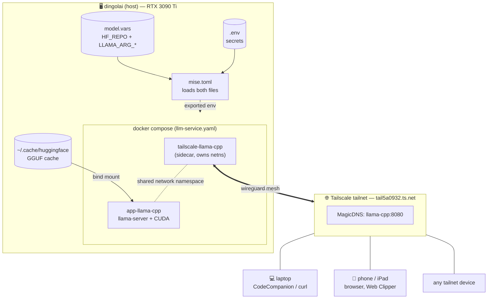

# Local LLM Stack

A tailnet-exposed [llama.cpp](https://github.com/ggml-org/llama.cpp) server running on `dingolai`'s GPU (RTX 3090 Ti), with config split across `.env` (secrets) and `model.vars` (runtime knobs).

> [!summary]
> Two containers — a **tailscale sidecar** and **llama-server** — share a network namespace so the llama API is reachable on the tailnet host `llama-cpp.tail5a0932.ts.net:8080`. ==Mise loads `.env` + `model.vars` into the task shell; `docker compose` interpolates them into the container.== Sampling defaults stay on the client.

## High-level architecture



## Quick start

```bash
mise run qwen27b             # bring up llama.cpp with model.vars config
mise run status              # one-line state check
mise run logs                # follow llama-cpp logs
mise run down                # tear it all down
```

Point any OpenAI-compatible client at `http://llama-cpp:8080/v1`.

## Files at a glance

| Path | Purpose |
|---|---|
| `llm-service.yaml` | Docker compose: tailscale sidecar + llama-server |
| `.env` | ==Secrets — gitignored.== `TS_AUTHKEY`, `SERVICE`. |
| `model.vars` | Tracked — `HF_REPO` + `LLAMA_ARG_*` runtime knobs. |
| `mise.toml` | Task wrappers (`qwen27b`, `down`, `status`, `debug`, `logs`, `logs:ts`) |
| `clipper-templates/` | Obsidian Web Clipper templates that target this server |
| `config/` | Tailscale serve config (mounted into sidecar) |
| `ts/state/` | Tailscale node state — persists auth across recreates |

## Read next

- [[operations]] — every mise task, how config flows, changing the model
- [[clients]] — URL forms, web UI, curl, Neovim plugins, mobile, sharing with non-tailnet users
- [[troubleshooting]] — common boot-time failures and exact remedies
