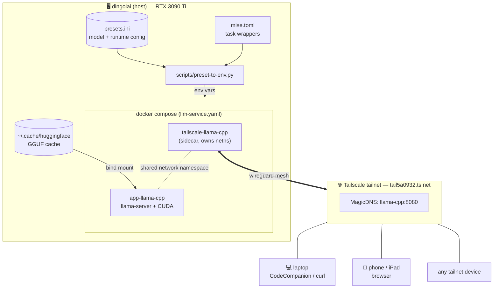

# Local LLM Stack

A tailnet-exposed [llama.cpp](https://github.com/ggml-org/llama.cpp) server running on `dingolai`'s GPU (RTX 3090 Ti), with declarative model presets and one-command variant switching.

> [!summary]
> Two containers — a **tailscale sidecar** and **llama-server** — share a network namespace so the llama API is reachable on the tailnet host `llama-cpp.tail5a0932.ts.net:8080`. Model and runtime config live in `presets.ini`; a `mise` task picks a section, materialises it into env vars, and brings the stack up. ==Sampling defaults stay on the client.==

## High-level architecture



## Quick start

```bash
mise run qwen27b-balanced    # bring up Qwen3.6-27B with default 16k ctx
mise run status              # one-line state check
mise run logs                # follow llama-cpp logs
mise run down                # tear it all down
```

Then point any OpenAI-compatible client at `http://llama-cpp:8080/v1`.

## Files at a glance

| Path | Purpose |
|---|---|
| `llm-service.yaml` | Docker compose: tailscale sidecar + llama-server |
| `presets.ini` | One section per variant; `[*]` holds shared defaults |
| `mise.toml` | Variant tasks (`qwen27b-balanced`, `qwen35b`, …) + diagnostics |
| `scripts/preset-to-env.py` | Reads `presets.ini`, prints `KEY=value` for `source` |
| `.env` | Secrets — `TS_AUTHKEY`, `SERVICE`. Do not commit. |
| `config/` | Tailscale serve config (mounted into sidecar) |
| `ts/state/` | Tailscale node state — persisting auth across recreates |

## Read next

- [[operations]] — every mise task, how a variant flows from INI to running container, adding new variants, where sampling lives.
- [[clients]] — URL forms, web UI, curl, Neovim plugins, mobile, sharing with non-tailnet users.
- [[troubleshooting]] — common boot-time failures and exact remedies.
