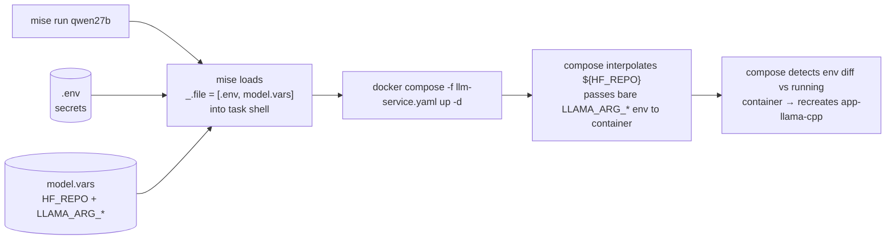

# Operations

How to run the stack and change config. For connection methods see [[clients]]; for failure modes see [[troubleshooting]].

## Mise task reference

| Task | Description |
|---|---|
| `mise run qwen27b` | Bring the stack up using `model.vars` |
| `mise run status` | Compose state + currently loaded model + ctx + VRAM |
| `mise run debug` | Full diagnostic dump — use when boot fails |
| `mise run logs` | Follow `llama-cpp` container logs |
| `mise run logs:ts` | Follow `tailscale` sidecar logs |
| `mise run down` | Stop and remove both containers |

`mise tasks ls` lists everything with descriptions.

## How config reaches the container



Mise's `'_'.file = [".env", "model.vars"]` loads both files into the task's shell env in order. Compose then reads the shell env for two purposes:

1. **Interpolation** — `${HF_REPO}` in the compose `command:` is filled from the shell at parse time.
2. **Passthrough** — every bare `- LLAMA_ARG_*` entry under `environment:` is read from the shell and injected into the container.

> [!info] Why two files instead of one
> `.env` is gitignored at the dotfiles root — it holds `TS_AUTHKEY` and other secrets that must not be committed. `model.vars` is tracked, so the project's runtime config travels with the repo. Splitting them lets you commit/share the config side without leaking the auth side.

## Changing the model or runtime knobs

Edit `model.vars` directly, then bring the stack down + up so compose picks up the change:

```ini
# model.vars
HF_REPO=unsloth/Qwen3.6-35B-A3B-MTP-GGUF:Q4_K_M
LLAMA_ARG_CTX_SIZE=32768
LLAMA_ARG_N_GPU_LAYERS=99
LLAMA_ARG_FLASH_ATTN=on
LLAMA_ARG_CACHE_TYPE_K=q8_0
LLAMA_ARG_CACHE_TYPE_V=q8_0
LLAMA_ARG_JINJA=true
LLAMA_ARG_REASONING=off
LLAMA_ARG_N_CPU_MOE=17
LLAMA_ARG_BATCH=4096
LLAMA_ARG_UBATCH=1024
LLAMA_ARG_N_PARALLEL=2
LLAMA_ARG_NO_MMAP=1
```

Then:

```bash
mise run down && mise run qwen27b
```

> [!tip] Why `down` first
> `docker compose up -d` *usually* detects env changes and recreates the affected container — but only for vars referenced by `${...}` interpolation. Bare passthroughs (`- LLAMA_ARG_*`) don't always trigger a recreate hash diff. `mise run down && mise run qwen27b` guarantees the new config is applied.

## What knobs you can put in `model.vars`

Anything that maps to a `LLAMA_ARG_*` env var in `llama-server`'s help. The current `model.vars` covers the common ones:

| Variable | Effect |
|---|---|
| `HF_REPO` | `-hf <repo>:<quant>` — model to download/load |
| `LLAMA_ARG_CTX_SIZE` | `--ctx-size N` |
| `LLAMA_ARG_N_GPU_LAYERS` | `--n-gpu-layers N` (use `99` for "all") |
| `LLAMA_ARG_FLASH_ATTN` | `on` / `off` / `auto` |
| `LLAMA_ARG_CACHE_TYPE_K` / `_V` | `f16`, `q8_0`, `q4_0`, etc. |
| `LLAMA_ARG_JINJA` | `true`/`false` — use model's Jinja chat template |
| `LLAMA_ARG_REASONING` | `on` / `off` / `auto` — chain-of-thought |
| `LLAMA_ARG_N_CPU_MOE` | offload N MoE layers to CPU (for big MoEs) |
| `LLAMA_ARG_BATCH` / `_UBATCH` | prompt-processing batch sizes |
| `LLAMA_ARG_N_PARALLEL` | server slot count |
| `LLAMA_ARG_NO_MMAP` | any value disables mmap (rare; CPU-MoE wants this) |

If you need a flag without an `LLAMA_ARG_*` binding, either:

- Hardcode it in the `command:` block of `llm-service.yaml`, or
- Send it per-request in the API call (works for all sampling params).

## Sampling lives on the client, not the server

==`llama-server` has env-var bindings for runtime knobs but **not** for sampling (`temp`, `top_p`, `top_k`, `min_p`, etc.).== To apply sampling defaults, send them per-request:

```bash
curl http://llama-cpp:8080/v1/chat/completions -d '{
  "model": "qwen27b",
  "messages": [{"role":"user","content":"hi"}],
  "temperature": 0.7,
  "top_p": 0.8,
  "top_k": 20
}'
```

Or configure your client (CodeCompanion, Open WebUI, etc.) with these defaults baked in.

## Lifecycle: opt-in only, no auto-start at boot

> [!note]
> Both services use `restart: "no"` in `llm-service.yaml`. The stack runs **only** when you explicitly start it with `mise run qwen27b`, and it does not come back after a reboot or `mise run down`. This keeps the GPU/RAM free when you're not using it.
>
> - **Start it**: `mise run qwen27b`
> - **Stop it**: `mise run down` (or just reboot)
> - **Crash behavior**: with `"no"`, a crashed llama-server stays down — you'll notice and restart it. If you'd rather it auto-recover within a session (but still not start at boot), change both `restart:` lines to `on-failure`.

`restart: always` (the old setting) is what previously resurrected the containers at boot, because Docker's daemon is enabled and restarts every `always` container on startup. If this is the *only* Docker workload on the host and you want to go further, you could `sudo systemctl disable docker.service` — but leaving the daemon enabled is harmless now that nothing is set to auto-restart.

## State that persists across recreates

> [!note]
> A few things survive `mise run down` + `mise run qwen27b`:
>
> - **`./ts/state/`** — Tailscale node identity. With `TS_AUTH_ONCE=true`, the auth key isn't re-consumed on each restart.
> - **`~/.cache/huggingface/`** — GGUF cache. Models downloaded once stay forever.
> - **Kernel page cache** — host's file-cache that makes second-and-later mmap-loads fast. Survives container recreate but not host reboot.

## Direct `docker compose` invocation (without mise)

Mise is the supported entry point, but if you ever need to bypass it:

```bash
docker compose -f llm-service.yaml --env-file .env --env-file model.vars up -d
```

Both `--env-file` flags are required — compose only auto-loads `.env`, not `model.vars`.

## See also

- [[clients]] — how to call the running service
- [[troubleshooting]] — when something goes wrong
- [[README]] — high-level system diagram
