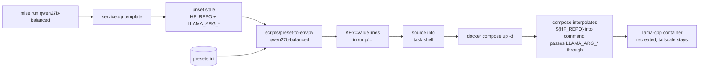

# Operations

How to run the stack, switch models, and add new variants. For connection methods see [[clients]]; for failure modes see [[troubleshooting]].

## Mise task reference

| Task | Description |
|---|---|
| `mise run qwen27b-balanced` | Qwen3.6-27B dense, ctx 16384 |
| `mise run qwen27b-creative` | Same model, ctx 32768 |
| `mise run qwen35b` | Qwen3.6-35B-A3B MoE, hybrid GPU+CPU (17 MoE layers on CPU) |
| `mise run status` | Compose state + currently loaded model + ctx + VRAM |
| `mise run debug` | Full diagnostic dump — use when boot fails |
| `mise run logs` | Follow `llama-cpp` container logs |
| `mise run logs:ts` | Follow `tailscale` sidecar logs |
| `mise run down` | Stop and remove both containers |

`mise tasks ls` lists everything with descriptions.

## How a variant becomes a running container



> [!info] Why `source`, not `--env-file`
> Compose's interpolation priority is **shell env > `--env-file` > `.env`**. A stale `HF_REPO` from an earlier `mise activate` would beat `--env-file` and silently override your preset. Sourcing into the task shell forces our values into compose's process env, where they win.
>
> The `service:up` template `unset`s the relevant vars before sourcing, as belt-and-suspenders.

## Adding a new variant

1. Add a section in `presets.ini` with at least `hf-repo`:
   ```ini
   [my-model]
   hf-repo = user/Repo-GGUF:Q5_K_M
   ctx-size = 32768
   ```
2. Add a 3-line task in `mise.toml`:
   ```toml
   [tasks.my-model]
   extends = "service:up"
   env.preset = "my-model"
   ```
3. `mise run my-model` — compose detects the env change and recreates the container with the new model. First boot for an uncached model includes the HF download (~17 GB for a 27B-Q4); subsequent boots are mmap-load only (~10 s).

## What `[*]` does

The `[*]` section in `presets.ini` is merged into every other section as defaults. Per-section keys win. Use it for things you always want the same across variants:

```ini
[*]
n-gpu-layers = 99
flash-attn = on
cache-type-k = q8_0
cache-type-v = q8_0
jinja = true
ctx-size = 16384

[qwen27b-balanced]
hf-repo = unsloth/Qwen3.6-27B-GGUF:UD-Q4_K_XL
; inherits everything from [*]
```

## Sampling lives on the client, not the server

==`llama-server` exposes runtime knobs (`LLAMA_ARG_CTX_SIZE`, `LLAMA_ARG_N_CPU_MOE`, etc.) as env vars, but **not** sampling knobs (`temp`, `top_p`, `top_k`, `min_p`, …).==

The sampling keys in `presets.ini` (e.g. in `[qwen35b]`) are **documentation only** — `scripts/preset-to-env.py` skips them with a `skipped 'temp' (sampling — client-side only)` line on stderr. To apply them, send them per-request:

```bash
curl http://llama-cpp:8080/v1/chat/completions -d '{
  "model": "unsloth/Qwen3.6-35B-A3B-MTP-GGUF:Q4_K_M",
  "messages": [{"role":"user","content":"hi"}],
  "temperature": 0.7,
  "top_p": 0.8,
  "top_k": 20,
  "min_p": 0.0
}'
```

Or configure your client (CodeCompanion, Open WebUI, etc.) with these defaults.

## What the adapter script actually does

`scripts/preset-to-env.py SECTION`:

1. Reads `../presets.ini` relative to the script's parent dir.
2. Strips any pre-section preamble (e.g. `version = 1`) so Python's `configparser` is happy.
3. Merges `[*]` into the requested section (section keys override).
4. For each key, looks up the matching `LLAMA_ARG_*` env name and prints `KEY=value`.
5. Skips sampling keys with a stderr note; warns on unknown keys.
6. Special-cases negation flags (`no-mmap = true` → `LLAMA_ARG_NO_MMAP=1`).

The mapping table lives at the top of the script — edit it if llama.cpp adds a new flag with an `LLAMA_ARG_*` binding you want to expose.

## State that persists across recreates

> [!note]
> Container state is ephemeral by design, but a few things survive `mise run down` + `mise run <variant>`:
>
> - **`./ts/state/`** — Tailscale's node identity. As long as this volume exists and `TS_AUTH_ONCE=true`, you don't re-consume the auth key on each restart.
> - **`~/.cache/huggingface/`** — the GGUF cache. Models downloaded once stay forever (until you `rm`).
> - **The kernel page cache** — the host file-cache that makes second-and-later mmap-loads fast. Survives container recreate but not host reboot.

## See also

- [[clients]] — how to call the running service
- [[troubleshooting]] — when something goes wrong
- [[README]] — high-level system diagram
